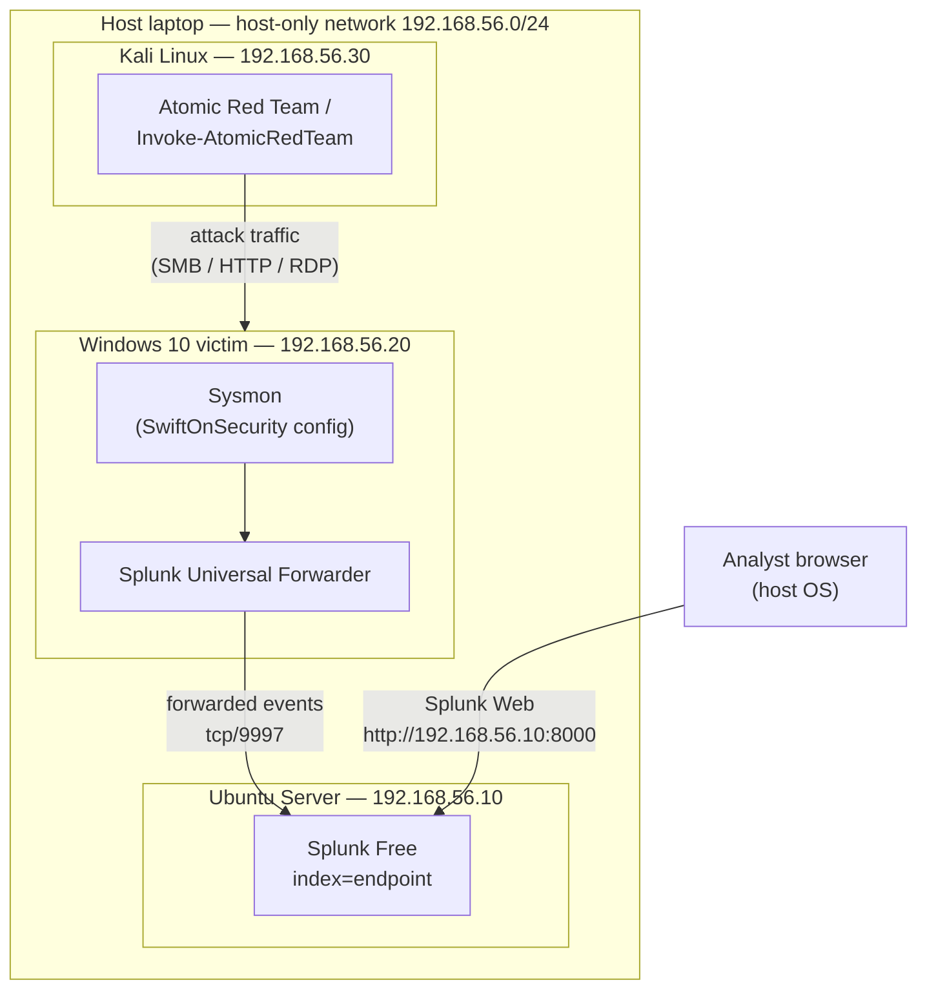

# Architecture Diagram

Two representations of the lab topology live here: a Mermaid version (renders
natively on GitHub) and an ASCII version (readable in any terminal or editor).

Once the lab is physically up, export a clean PNG from draw.io or Excalidraw
and drop it next to this file as `architecture-diagram.png` — the main README
embeds the PNG, not this Markdown source.

---

## Mermaid



Four event channels are forwarded from the victim to Splunk:

- `WinEventLog:Security`
- `WinEventLog:Microsoft-Windows-Sysmon/Operational`
- `WinEventLog:Microsoft-Windows-PowerShell/Operational`
- `WinEventLog:System`

All land in `index=endpoint`, tagged by `sourcetype`.

---

## ASCII

```
          +------------------------------------------------------+
          |         Host laptop (Windows / macOS / Linux)        |
          |                                                      |
          |   VirtualBox / VMware host-only network              |
          |   192.168.56.0/24                                    |
          |                                                      |
          |   +-----------------------+   +--------------------+ |
          |   |   Windows 10 victim   |   |    Kali Linux      | |
          |   |   192.168.56.20       |   |    192.168.56.30   | |
          |   |                       |   |                    | |
          |   |   Sysmon (SwiftOS)    |<--+ Atomic Red Team    | |
          |   |   Splunk UF ---+      |   | / Invoke-ART       | |
          |   +----------------|------+   +--------------------+ |
          |                    |                                 |
          |                    |  tcp/9997                       |
          |                    v                                 |
          |   +-----------------------------+                    |
          |   |   Ubuntu Server             |                    |
          |   |   192.168.56.10             |                    |
          |   |   Splunk Free               |                    |
          |   |   index=endpoint            |<-- Splunk Web      |
          |   +-----------------------------+    :8000           |
          +------------------------------------------------------+
```

---

## Design notes

- **Host-only network, no NAT.** Keeps all attack traffic contained. Any
  internet access on the victim is a deliberate, temporary toggle (to pull
  down Atomic Red Team payloads).
- **UF, not HEC.** A forwarder is what Tier 1 analysts encounter in real
  environments; HEC would be faster to set up but less representative.
- **Single endpoint by design.** No domain controller or second workstation
  in this lab — the plan deliberately stays single-endpoint so week-by-week
  focus stays on detection writing and investigation, not AD plumbing. Later
  showcase expansions can add a DC and a second endpoint for lateral
  movement coverage.
- **Attacker is isolated.** Kali has no Splunk forwarder installed — it
  should appear in Splunk only through the victim's perspective (inbound
  network connections, failed logons, etc.), which is exactly how it would
  look in a real intrusion.
